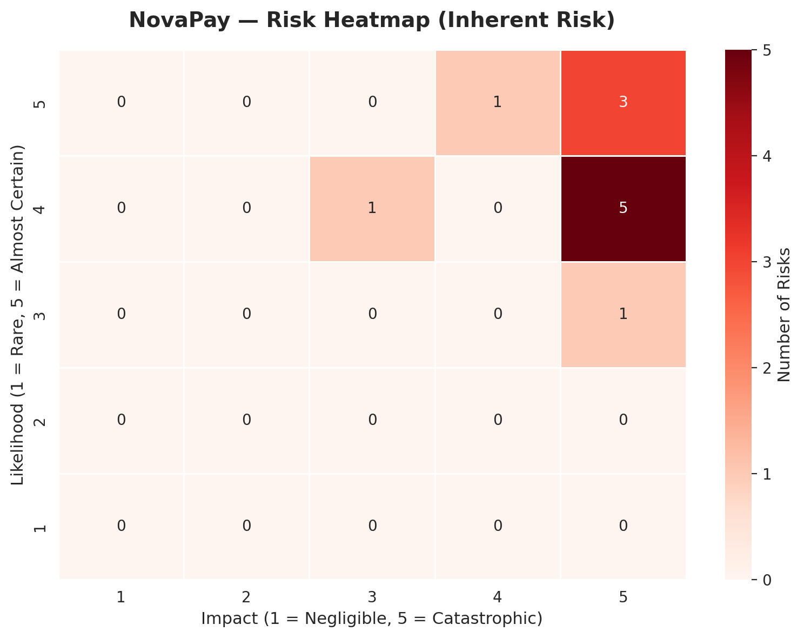
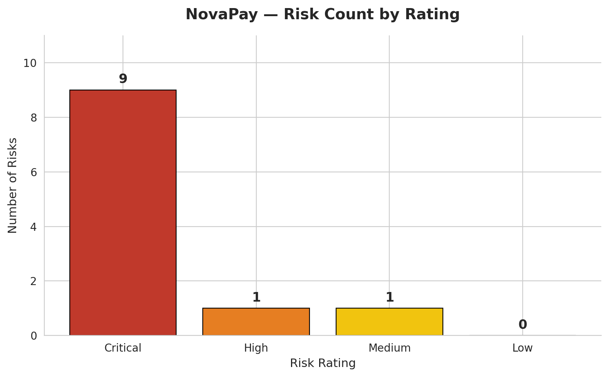
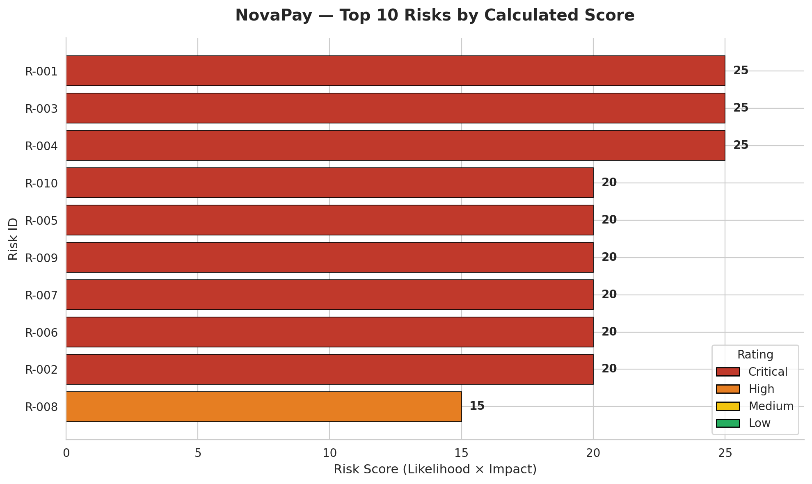
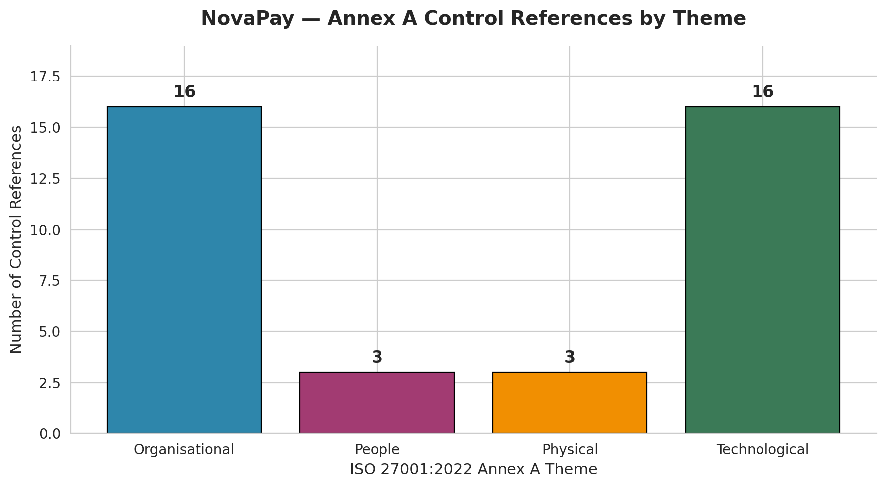
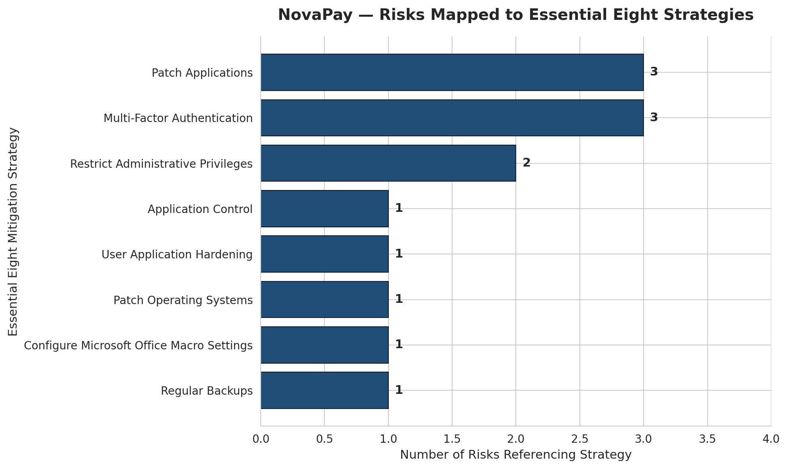
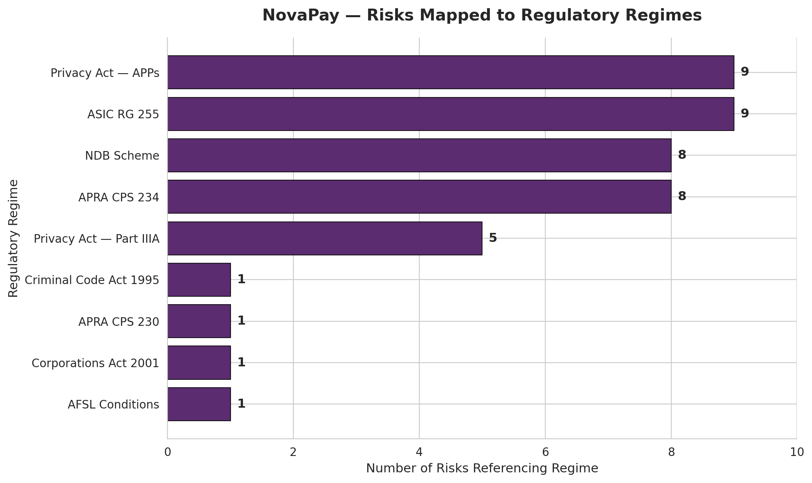

# novapay-grc-portfolio 
A learning portfolio piece demonstrating GRC consulting methodology applied to a fictional Australian fintech.

This repository contains a demonstration GRC engagement built around **NovaPay Pty Ltd**, a fictional Melbourne-based fintech preparing for an Authorised Deposit-taking Institution (ADI) licence application. The project applies real Australian regulatory frameworks to a realistic pre-ISMS environment, then uses Python to process and visualise the resulting risk register.

The work represents the practical application phase of a structured GRC learning programme focused on the Australian consulting market.

---

## About the case study

NovaPay is a fictional 52-person fintech operating under an Australian Financial Services Licence (AFSL) and preparing for an ADI licence. It runs a consumer lending platform on AWS, holds Equifax credit report data, and processes personal and financial information for approximately 14,200 customers.

The NovaPay case study was constructed to exhibit the type of multi-regulator triangulation — ASIC, OAIC, and future APRA — that is characteristic of growth-stage Australian fintechs and represents the consulting engagement archetype this portfolio is targeting. Three current Australian regulatory regimes apply (**ASIC RG 255**, the **Privacy Act 1988 (Cth)** including **Part IIIA**, and the **Notifiable Data Breaches (NDB) Scheme**), with **APRA CPS 234** becoming relevant as the ADI licence is pursued.

---

## Project scope

The project **simulates** an early-stage GRC consulting assessment producing:

- A **multi-framework gap analysis** against ISO/IEC 27001:2022 Annex A controls, the ASD Essential Eight, and the relevant Australian regulatory regimes
- A **risk register** of 11 risks (R-001 to R-011) developed through ISO 31000-aligned risk identification, with inherent and residual scoring
- A **data pipeline** built in Python that ingests the risk register, applies ISO 31000-aligned scoring methodology, categorises risks against defined bands, and outputs a processed dataset
- A **visualisation layer** producing six static charts covering risk concentration, severity distribution, treatment priority, ISO 27001 theme coverage, Essential Eight strategy exposure, and Australian regulatory exposure

The frameworks referenced reflect the regulatory landscape applicable to the case study, not a generic compliance checklist.

---

## Repository structure

```
novapay-grc-portfolio/
├── data/
│   ├── novapay_risks_v2.xlsx          # Source risk register (11 risks)
│   ├── novapay_risks_v2.csv           # Risk register as CSV (pipeline input)
│   └── novapay_risks_processed.csv    # Pipeline output with calculated scores
├── pipeline/
│   └── risk_pipeline.py               # ISO 31000-aligned scoring and categorisation
├── dashboard/
│   └── charts.py                      # Six-chart visualisation module
├── visuals/
│   ├── 01_risk_heatmap.png
│   ├── 02_risks_by_rating.png
│   ├── 03_top_10_risks.png
│   ├── 04_annex_a_themes.png
│   ├── 05_essential_eight.png
│   └── 06_regulatory_exposure.png
└── README.md
```

---

## Frameworks applied

| Framework | Role |
|---|---|
| **ISO/IEC 27001:2022** | Primary control framework — Annex A used for gap analysis |
| **ISO 31000:2018** | Risk scoring methodology (Likelihood × Impact) |
| **ASD Essential Eight** | Australian baseline cyber mitigation strategies |
| **Privacy Act 1988 (Cth)** | APP and Part IIIA (credit reporting) compliance |
| **ASIC RG 255** | AFSL holder cyber resilience expectations |
| **APRA CPS 234** | Future-state obligation tied to ADI licence pursuit |
| **NDB Scheme** | Eligible data breach notification regime |

---

## Risk scoring methodology

Risks are scored on a 5×5 likelihood-impact matrix and categorised into four bands aligned with ISO 31000 implementation guidance:

| Band | Score range | Treatment expectation |
|---|---|---|
| Critical | 20–25 | Immediate action required; escalation to executive |
| High | 13–19 | Treatment plan within current quarter |
| Medium | 7–12 | Scheduled treatment; periodic review |
| Low | 1–6 | Retain with monitoring |

The pipeline applies these bands programmatically, producing reproducible categorisation across the full register.

---

## Dashboard

The visualisation module produces six charts addressing distinct executive questions.

### 1. Risk Heatmap



A 5×5 likelihood-impact matrix showing where risks cluster. Risks concentrate in the upper-right quadrant — a pattern consistent with a fintech operating without a formal information security management system.

### 2. Risks by Rating



Severity distribution across the four rating bands. Nine of eleven risks are rated Critical, with the remainder split between High and Medium. The absence of Low-rated risks reflects the early-stage nature of the case study environment.

### 3. Top 10 Risks by Score



Ranked priority view. The three highest-scoring risks (R-001, R-003, R-004) cover AWS administrative access, the absence of an incident response plan, and Privacy Act non-compliance. Multiple risks scoring at or near the maximum suggests remediation cannot proceed strictly one risk at a time.

### 4. Risks by ISO 27001 Annex A Theme



Distribution across the four Annex A themes. Organisational and Technological controls account for the majority of references, indicating governance and technology as the dominant remediation domains for the case study.

### 5. Risks Mapped to Essential Eight Strategies



Australian-specific cyber mitigation view. Multi-Factor Authentication and Patch Applications are the most-referenced strategies. Risks distribute across all eight strategies, indicating broad rather than concentrated Essential Eight exposure.

### 6. Risks Mapped to Regulatory Regimes



The compliance exposure view across the Australian regulatory landscape. Privacy Act APPs, ASIC RG 255, APRA CPS 234, and the NDB Scheme each touch the majority of risks. A single incident in this environment would likely create reporting obligations to multiple regulators concurrently.

---

## How to run

### Prerequisites
- Tested on Python 3.12.10 (Windows)
- Required libraries: `pandas`, `matplotlib`, `seaborn`

```bash
pip install pandas matplotlib seaborn
```

### Run the pipeline

```bash
python pipeline/risk_pipeline.py
```

Reads the source register, calculates risk scores, categorises into bands, and outputs `novapay_risks_processed.csv`.

### Generate the dashboard

```bash
python dashboard/charts.py
```

Reads the processed dataset and saves six PNG charts to the `visuals/` directory.

---

## Roadmap

This repository is an active learning artefact and continues to develop. Current priorities:

- Expanded methodology and design decisions write-up
- An Essential Eight maturity model assessment view (ML0 → ML3)

---

## About this project

Built by Muna as part of a structured GRC learning programme focused on the Australian consulting market.
---

## Disclaimer

NovaPay Pty Ltd is a fictional entity created for educational and portfolio purposes. The risk register, regulatory references, and remediation guidance in this repository are illustrative and **not approved for use in any live engagement, audit, or client communication**. All findings would require validation by a qualified GRC professional before any operational application.
